# Kubernetes EKS Platform

Production-grade Kubernetes platform deploying a Python Flask application
on Minikube/AWS EKS using Helm charts, with Horizontal Pod Autoscaling,
full cluster monitoring via Prometheus + Grafana, and health probes.

## Architecture

Developer pushes code to GitHub
↓
Docker builds Flask app image
↓
Helm deploys to Kubernetes (Minikube locally / EKS on AWS)
↓
Horizontal Pod Autoscaler scales pods 2→5 based on CPU load
↓
Prometheus scrapes metrics from all pods and nodes
↓
Grafana visualizes cluster health, deployments, and pod metrics
↓
Liveness + Readiness probes monitor pod health automatically

## Tech Stack

- **Orchestration:** Kubernetes (Minikube locally / AWS EKS in production)
- **Package Manager:** Helm v4
- **App:** Python Flask + Gunicorn
- **Containerization:** Docker
- **Autoscaling:** Horizontal Pod Autoscaler (HPA)
- **Monitoring:** Prometheus + Grafana (kube-prometheus-stack)
- **Cloud:** AWS EKS (eu-north-1)
- **CLI Tools:** kubectl · eksctl · helm

## Project Structure

kubernetes-eks-platform/
├── app/
│   ├── main.py                   # Flask app with /, /health, /info
│   └── requirements.txt          # Python dependencies
├── Dockerfile                    # Container build
├── helm/
│   └── flask-app/
│       ├── Chart.yaml            # Helm chart metadata
│       ├── values.yaml           # Configurable values
│       └── templates/
│           ├── deployment.yaml   # Kubernetes Deployment
│           ├── service.yaml      # NodePort Service
│           └── hpa.yaml          # Horizontal Pod Autoscaler
├── k8s/
│   └── namespace.yaml            # flask-app namespace
└── screenshots/                  # Architecture proof screenshots

## Key Features

- **Helm-managed deployment** — entire app deployed with one command
- **Horizontal Pod Autoscaling** — scales from 2 to 5 pods at CPU > 70%
- **Full cluster monitoring** — Prometheus + Grafana via kube-prometheus-stack
- **Health probes** — Kubernetes auto-restarts unhealthy pods
- **Namespace isolation** — app runs in dedicated `flask-app` namespace
- **Resource limits** — CPU and memory limits defined per pod
- **3 API endpoints** — `/` home, `/health` status, `/info` pod metadata
- **15 pods monitored** — full observability across all namespaces

## Quick Start (Local — Minikube)

### Prerequisites
- Docker Desktop running
- Minikube installed
- Helm installed
- kubectl installed

### Deploy Flask app

```bash
# Start Minikube
minikube start --driver=docker --cpus=2 --memory=3500

# Point Docker to Minikube
eval $(minikube docker-env)

# Build Docker image
docker build -t flask-k8s-app:latest .

# Create namespace
kubectl apply -f k8s/namespace.yaml

# Deploy with Helm
helm install flask-app helm/flask-app --namespace flask-app

# Access the app
minikube service flask-app-service -n flask-app
```

### Deploy Prometheus + Grafana monitoring

```bash
# Add Prometheus Helm repo
helm repo add prometheus-community \
  https://prometheus-community.github.io/helm-charts
helm repo update

# Install full monitoring stack
helm install monitoring prometheus-community/kube-prometheus-stack \
  --namespace monitoring --create-namespace

# Get Grafana password
kubectl get secret --namespace monitoring monitoring-grafana \
  -o jsonpath="{.data.admin-password}" | base64 -d ; echo

# Access Grafana
kubectl port-forward -n monitoring svc/monitoring-grafana 3000:80

# Access Prometheus
kubectl port-forward -n monitoring \
  svc/monitoring-kube-prometheus-prometheus 9090:9090
```

Open Grafana at http://localhost:3000 (admin / [password from above])
Import dashboard ID `6417` for Kubernetes metrics.

### Useful commands

```bash
# Check all resources
kubectl get all -n flask-app

# Check autoscaler
kubectl get hpa -n flask-app

# Check all namespaces
kubectl get pods --all-namespaces

# Check Helm releases
helm list --all-namespaces

# View pod logs
kubectl logs -l app=flask-app -n flask-app

# Upgrade deployment
helm upgrade flask-app helm/flask-app --namespace flask-app

# Delete everything
helm uninstall flask-app -n flask-app
helm uninstall monitoring -n monitoring
```

## API Endpoints

| Endpoint | Method | Response |
|---|---|---|
| `/` | GET | HTML homepage |
| `/health` | GET | JSON health status + pod name |
| `/info` | GET | JSON pod metadata + version |

## Kubernetes Resources

| Resource | Details |
|---|---|
| Deployment | 2 replicas, rolling update strategy |
| Service | NodePort on port 5000 |
| HPA | Min 2 / Max 5 pods, CPU threshold 70% |
| Namespace | flask-app (isolated environment) |
| Probes | Liveness + Readiness on /health |
| Monitoring | Prometheus + Grafana across all namespaces |

## Screenshots

### Pods Running
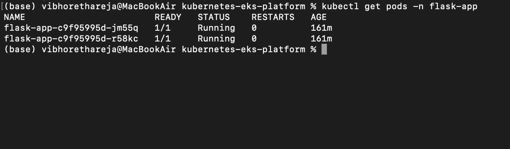

### All Kubernetes Resources
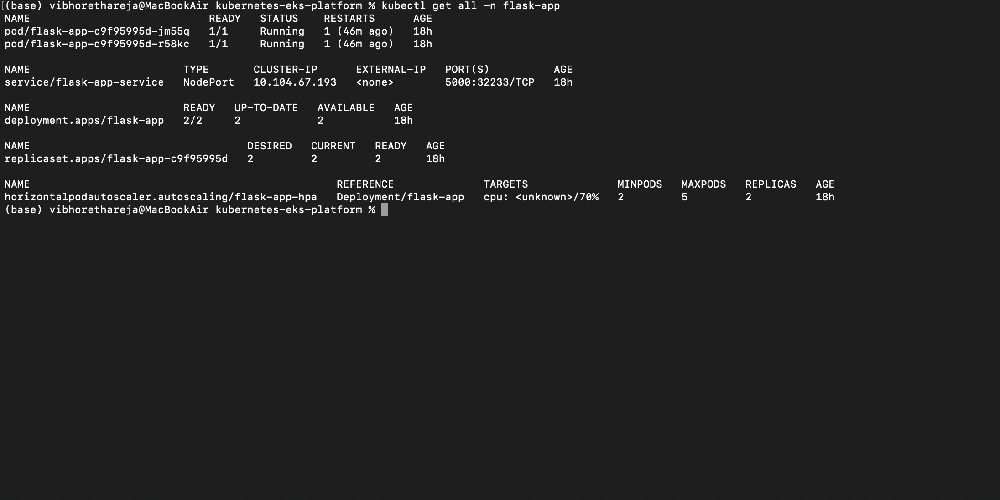

### Horizontal Pod Autoscaler
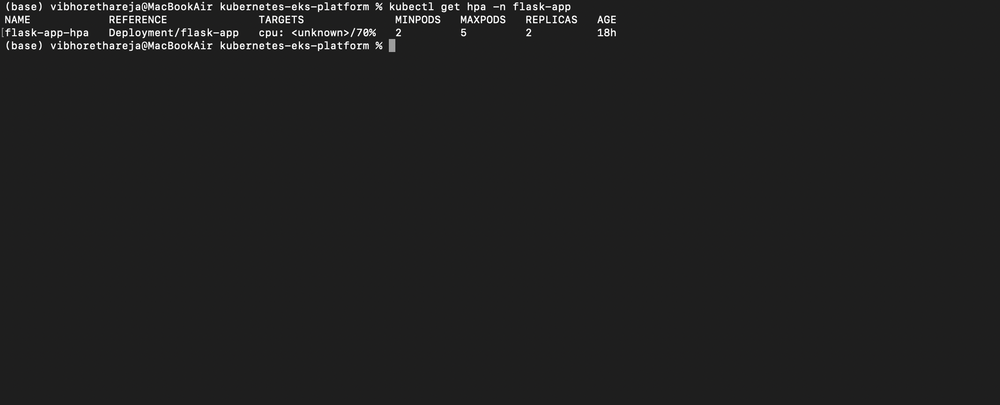

### Helm Releases (All Namespaces)
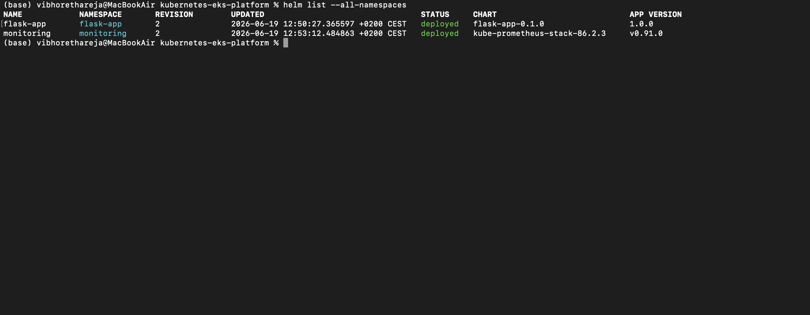

### Live Application
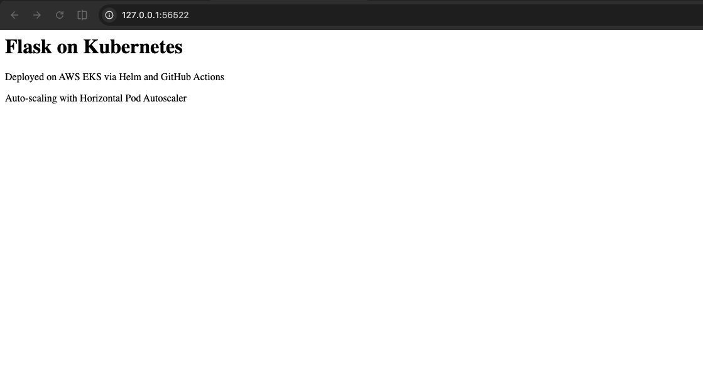

### Health Endpoint
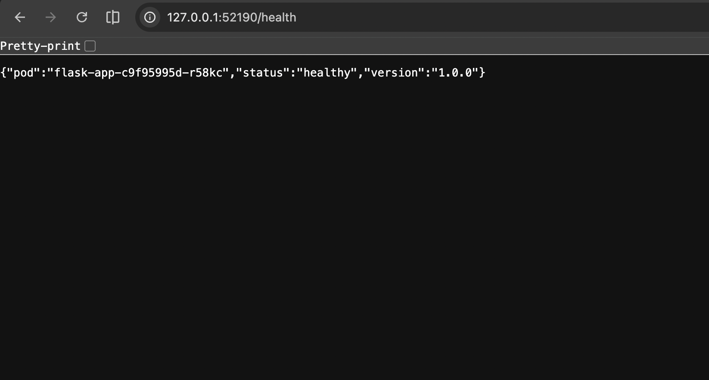

### Info Endpoint
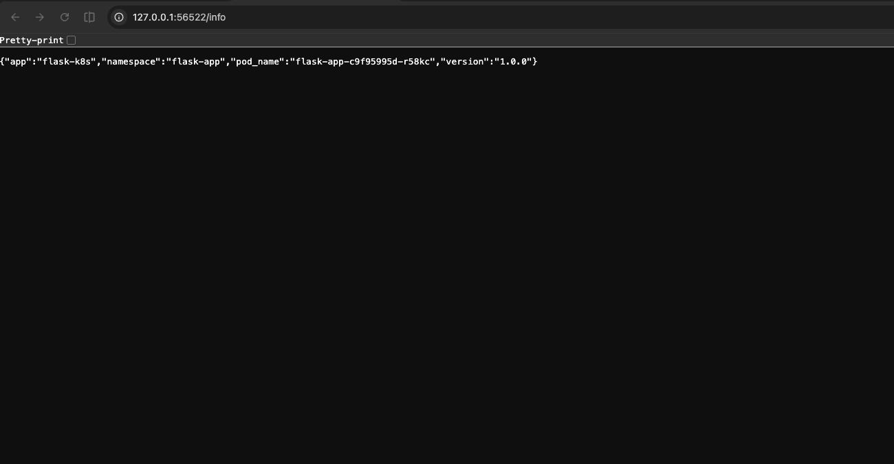

### Grafana — Cluster Overview
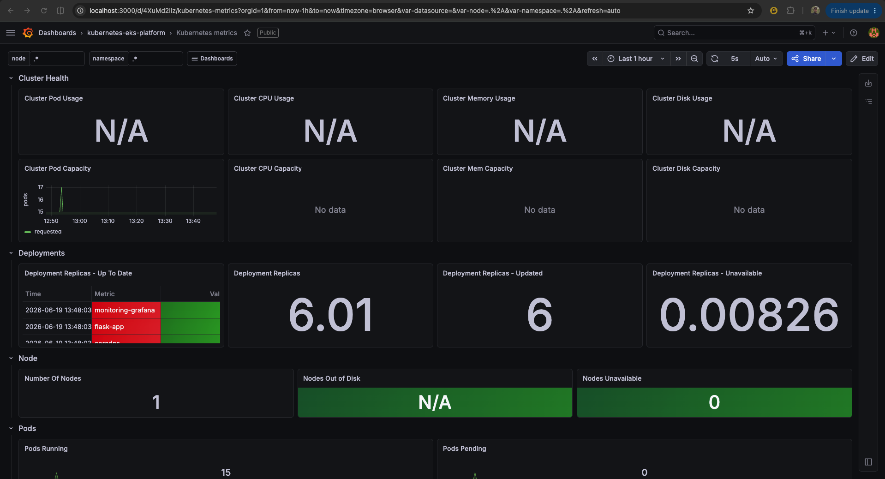

### Grafana — Pods & Containers
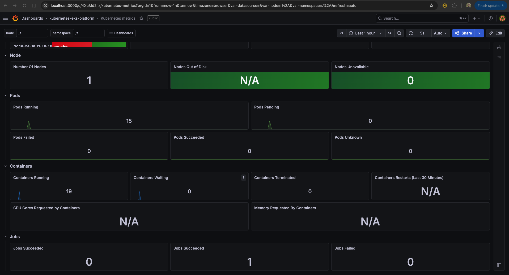

### Grafana — Node Metrics
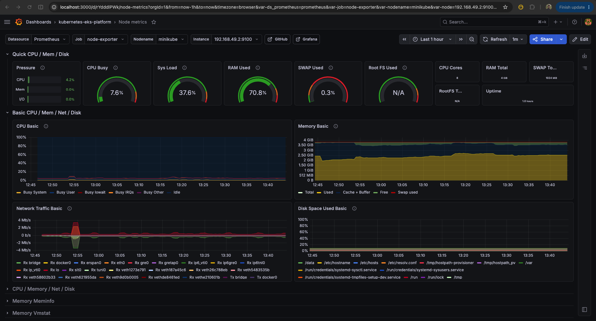

### Prometheus Targets
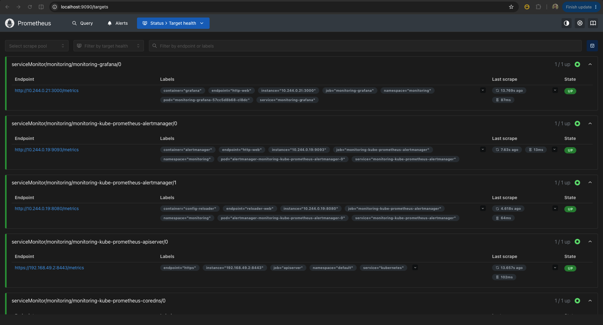

### Monitoring Pods
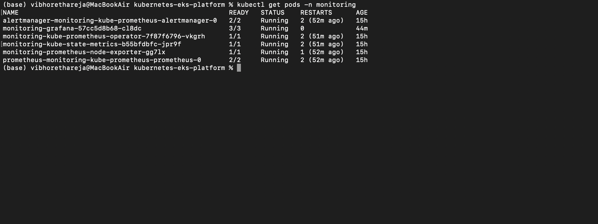

### All Namespaces
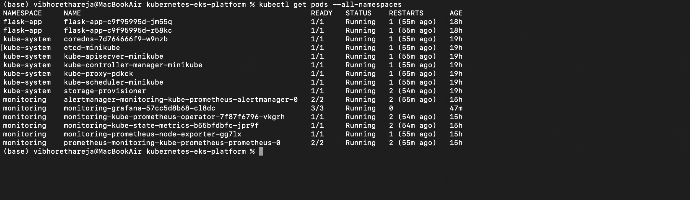

## Key Concepts Demonstrated

- Kubernetes Deployments, Services, and Namespaces
- Helm chart creation and lifecycle management
- Horizontal Pod Autoscaling based on CPU metrics
- Liveness and Readiness health probes
- Full cluster monitoring with Prometheus + Grafana
- kube-prometheus-stack deployment via Helm
- Container resource requests and limits
- kubectl CLI proficiency
- Multi-namespace Kubernetes architecture
- Local Kubernetes development with Minikube